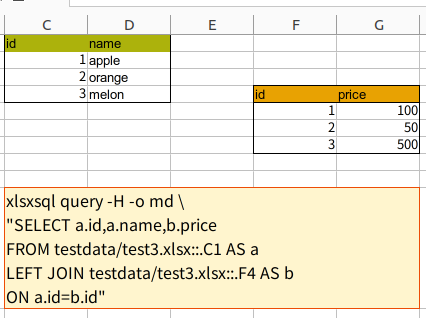

# xlsxsql

[](https://pkg.go.dev/github.com/noborus/xlsxsql)
[](https://github.com/noborus/xlsxsql/actions)

A CLI tool to execute SQL queries on xlsx files.



| id |  name  | price |
|----|--------|-------|
|  1 | apple  |   100 |
|  2 | orange |    50 |
|  3 | melon  |   500 |

Execute SQL on xlsx files using [xcelize](https://github.com/qax-os/excelize) and [trdsql](https://github.com/noborus/trdsql).
Output to various formats.

## Install

### Go install

```console
go install github.com/noborus/xlsxsql/cmd/xlsxsql@latest
```

### Homebrew

You can install Homebrew's xlsxsql with the following command:

```console
brew install noborus/tap/xlsxsql
```

### Binary Downloads

Precompiled binaries for xlsxsql are available for various platforms and architectures. You can download them from the [GitHub Releases](https://github.com/noborus/xlsxsql/releases) page.

The following binaries can be downloaded from release.

- Darwin_arm64
- Darwin_x86_64
- Linux_arm64
- Linux_i386
- Linux_x86_64
- Windows_arm64
- Windows_x86_64

To install a binary, download the appropriate file for your system, extract it, and place the `xlsxsql` executable in a directory included in your system's `PATH`.

For example, on a Unix-like system, you might do:

```console
tar xvf xlsxsql_Darwin_x86_64.tar.gz
mv xlsxsql /usr/local/bin/
```

## Usage

```console
$ xlsxsql --help
Execute SQL against xlsx file.
output to CSV and various formats.

Usage:
  xlsxsql [flags]
  xlsxsql [command]

Available Commands:
  completion  Generate the autocompletion script for the specified shell
  help        Help about any command
  list        List the sheets of the xlsx file
  query       Executes the specified SQL query against the xlsx file
  table       SQL(SELECT * FROM table) for xlsx

Flags:
  -H, --header       Output header
  -h, --help         help for xlsxsql
  -o, --out string   Output Format[CSV|AT|LTSV|JSON|JSONL|TBLN|RAW|MD|VF|YAML] (default "CSV")
  -s, --skip int     Skip the number of lines
  -v, --version      display version information

Use "xlsxsql [command] --help" for more information about a command.
```

### List sheets

```console
$ xlsxsql list test.xlsx
Sheet1
Sheet2
```

### Basic usage

The basic usage of xlsxsql is to run a SQL query against an Excel file.
The `query` command is used followed by the SQL query in quotes.
The SQL query should include the name of the Excel file. If no sheet is specified, the first sheet will be targeted.

```console
xlsxsql query "SELECT * FROM test.xlsx"
```

For example, if test.xlsx contains the following data in its first sheet:

| Name  | Age |
| ----- | --- |
| Alice | 20  |
| Bob   | 25  |
| Carol | 30  |

The output will be:

```csv
Name,Age
Alice,20
Bob,25
Carol,30
```

### Specify sheet

The sheet can be specified by using a double colon "::" after the file name
(the first sheet is selected by default if not specified).

```console
xlsxsql query "SELECT * FROM test.xlsx::Sheet2"
```

### Specify cell

Cell can be specified by using a dot "." after the sheet.

```console
xlsxsql query "SELECT * FROM test3.xlsx::Sheet1.C1"
```

Optional if the sheet is the first sheet.

```console
xlsxsql query "SELECT * FROM test3.xlsx::.C1"
```

Note: If cell is specified, the table up to the blank column is considered to be the table.
​
This allows multiple tables to be specified on one sheet, and JOIN is also possible.

```console
xlsxsql query -H -o md \
"SELECT a.id,a.name,b.price 
  FROM testdata/test3.xlsx::.C1 AS a
  LEFT JOIN testdata/test3.xlsx::.F4 AS b 
    ON a.id=b.id"
```

### Shorthand designation

The `table` command is a shorthand that allows you to quickly display the contents of a specified sheet in a table format.
The syntax is `xlsxsql table <filename>::<sheetname>.<cellname>`.
If no sheet name is specified, the first sheet of the Excel file will be targeted.

Here is an example:

```console
xlsxsql table test.xlsx::Sheet2.C1
```

### Output format

```console
xlsxsql query --out JSONL "SELECT * FROM test.xlsx::Sheet2"
```

You can choose from CSV, LTSV, JSON, JSONL, TBLN, RAW, MD, VF, YAML.

### Header Options

The `--header` or `-H` option treats the first line as a header.
Headers are treated as column names.
For example, use:

```console
xlsxsql query --header --out JSONL "SELECT * FROM test.xlsx::Sheet2"
```

### Skip Options

The `--skip` or `-s` option skips the specified number of lines.
For example, you would use it like this:

```console
xlsxsql query --skip 1 "SELECT * FROM test.xlsx::Sheet2"
```

Skip is useful when specifying sheets, allowing you to skip unnecessary rows.
(There seems to be no advantage to using skip when specifying Cell.)
